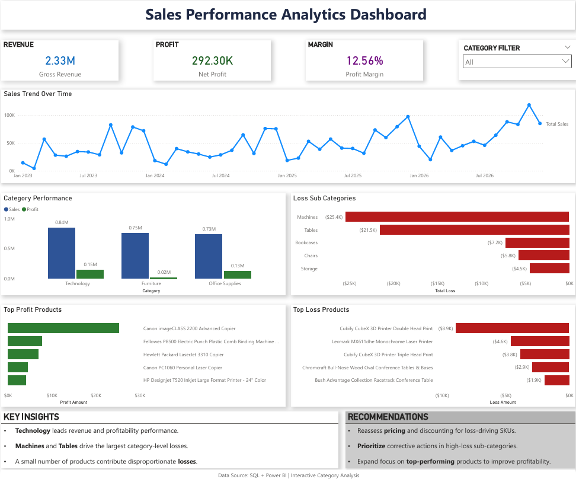

# Sales Analytics Dashboard

Data analytics project using SQL data transformation and Power BI to analyze sales performance, profitability, product-level loss drivers, and business insights.

## Dashboard Preview



---

## Project Overview

This project includes:

- Data import and cleaning using SQL  
- Exploratory analysis and aggregation queries  
- Analytical SQL views for reporting  
- Interactive Power BI dashboard development  
- Business insights and recommendations

---

## Tools Used

- MySQL  
- SQL  
- Power BI  
- DAX  
- Data Modeling

---

## Key Insights

- Technology leads revenue and profitability  
- Machines and Tables drive major losses  
- A small number of products contribute disproportionate losses  
- Product mix optimization may improve margins

---

## Business Recommendations

- Reassess pricing for loss-driving products  
- Reduce exposure in high-loss categories  
- Expand focus on profitable products  
- Improve margin through product mix optimization

---

## Repository Structure

```
sql/
01_data_import_cleaning.sql
02_exploratory_analysis.sql
03_analytical_views.sql
04_business_queries.sql

dashboard/
dashboard-screenshot.png
dashboard-export.pdf

data/
dataset-source-note.txt
```

---

## Author

Joshua Dominic  
Portfolio Project | Data Analytics
